# SƠ ĐỒ USE CASE - HỆ THỐNG QUẢN LÝ CLB

## 1. SƠ ĐỒ USE CASE TỔNG QUÁT

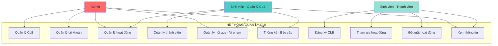

---

## 2. SƠ ĐỒ USE CASE ADMIN

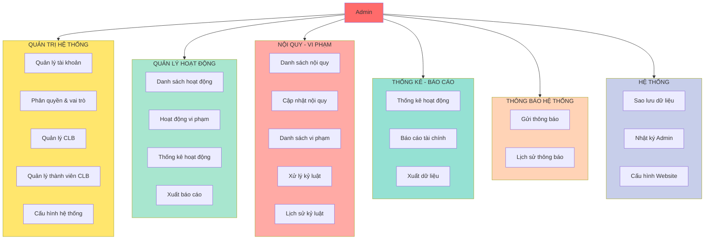

---

## 3. SƠ ĐỒ USE CASE SINH VIÊN - QUẢN LÝ CLB

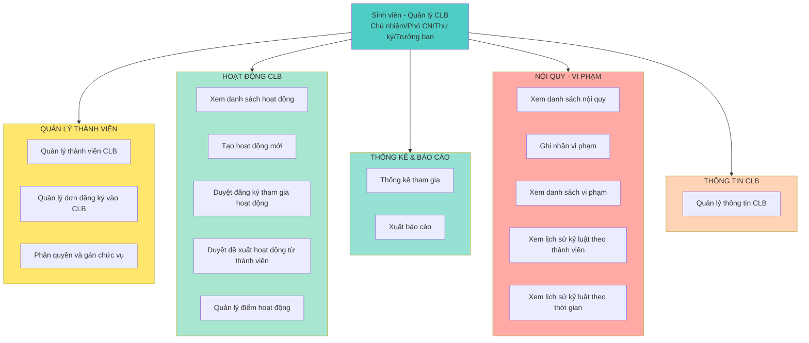

### 3.1. Chi tiết Use Case - Quản lý thành viên

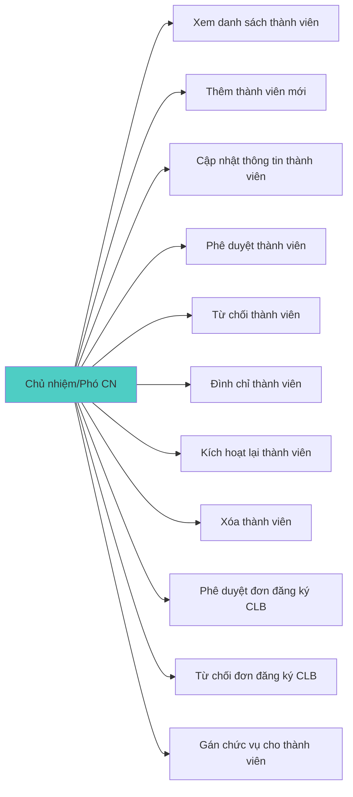

### 3.2. Chi tiết Use Case - Hoạt động CLB

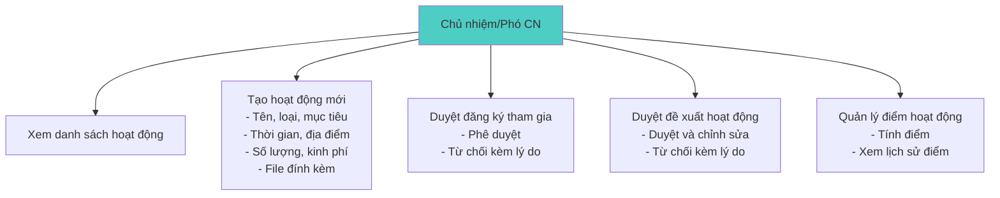

### 3.3. Chi tiết Use Case - Nội quy & Vi phạm

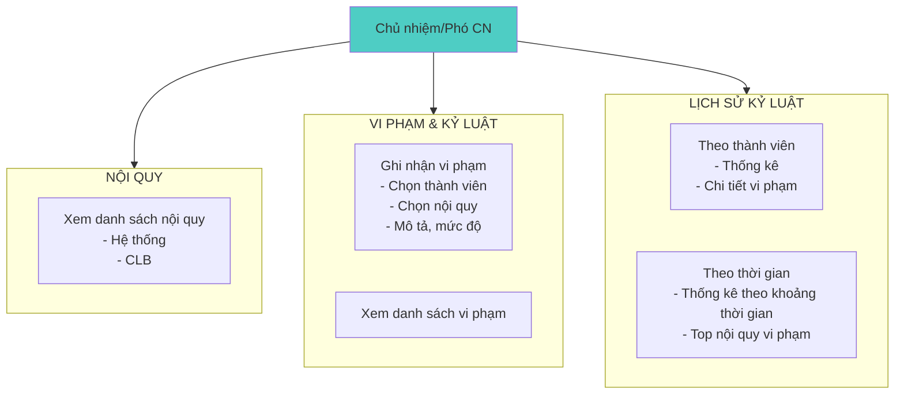

---

## 4. SƠ ĐỒ USE CASE SINH VIÊN - THÀNH VIÊN

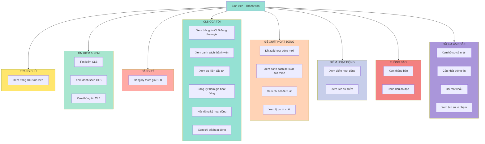

### 4.1. Chi tiết Use Case - Đề xuất hoạt động

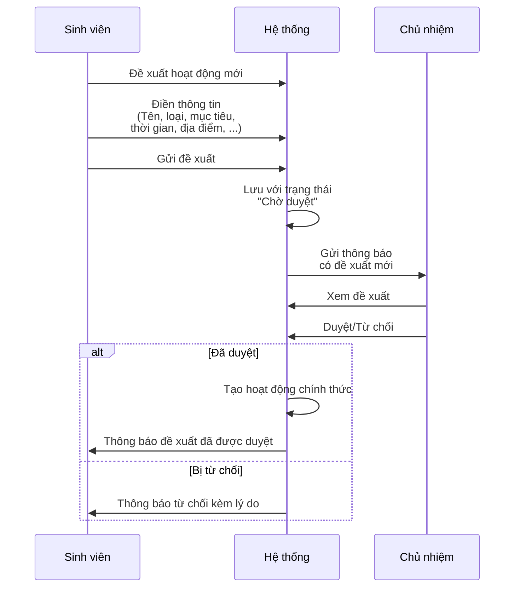

### 4.2. Chi tiết Use Case - Đăng ký hoạt động

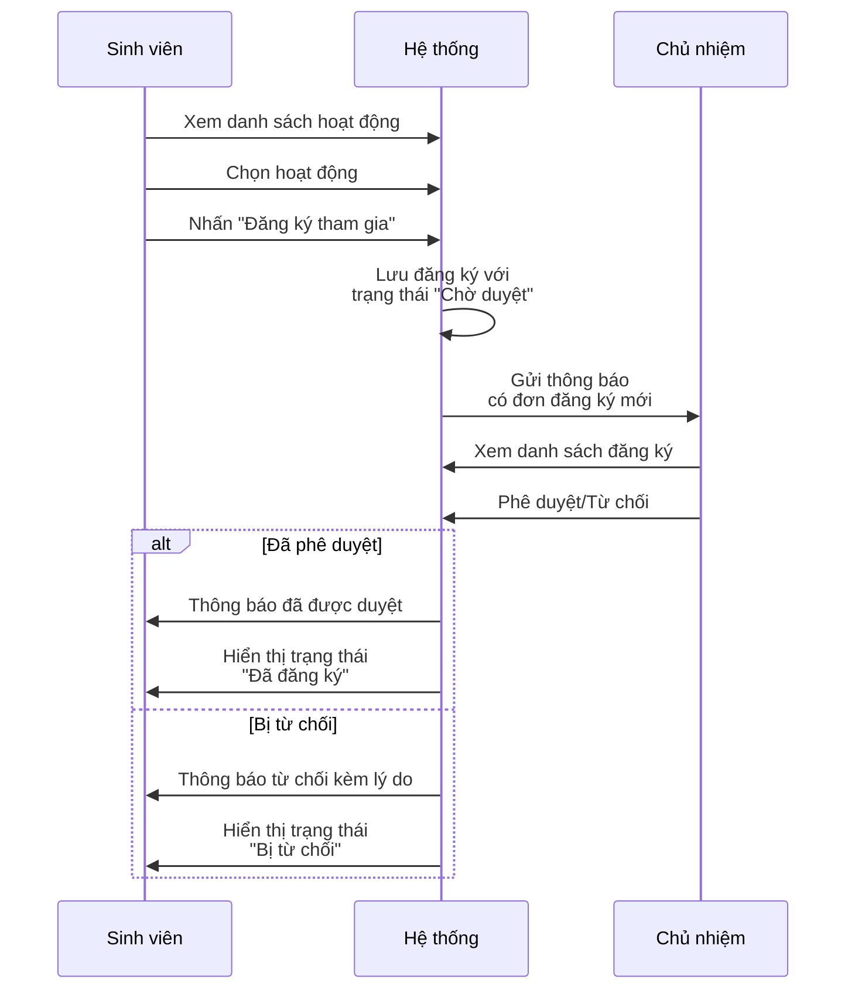

---

## 5. SƠ ĐỒ USE CASE CHI TIẾT - QUẢN LÝ HOẠT ĐỘNG CLB

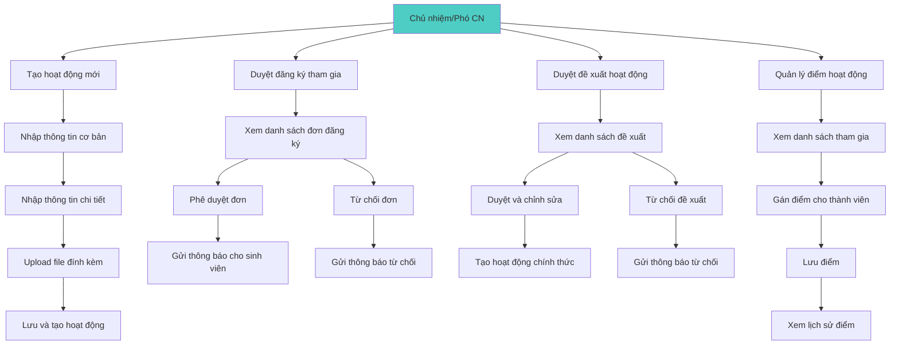

---

## 6. SƠ ĐỒ USE CASE CHI TIẾT - NỘI QUY & VI PHẠM

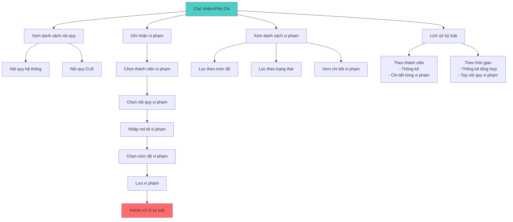

---

## GHI CHÚ

- Các sơ đồ được vẽ bằng Mermaid syntax, có thể xem trực tiếp trên GitHub, GitLab, hoặc các trình xem markdown hỗ trợ Mermaid
- Để xem sơ đồ, cần sử dụng trình xem markdown có hỗ trợ Mermaid (như VS Code với extension Mermaid Preview, hoặc GitHub)
- Màu sắc được phân biệt để dễ nhận biết các nhóm chức năng
- Các use case có thể mở rộng thêm tùy theo yêu cầu của hệ thống

